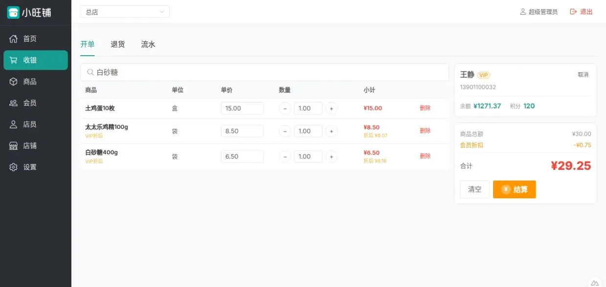
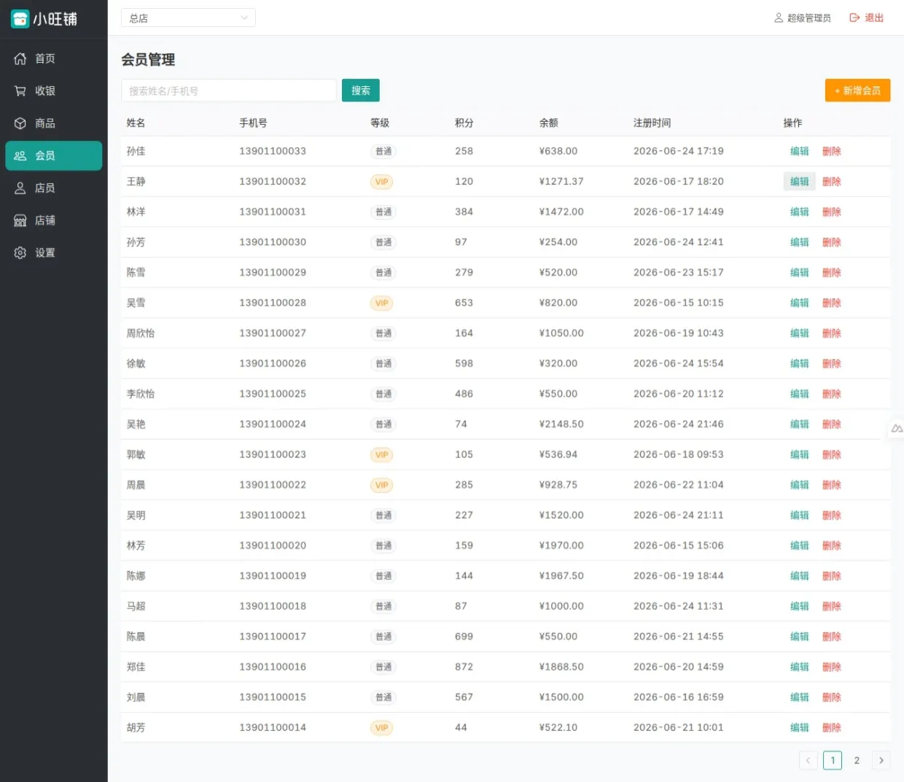
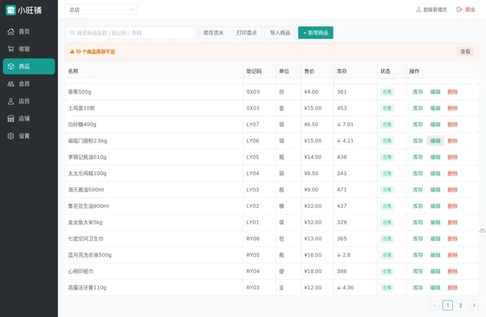
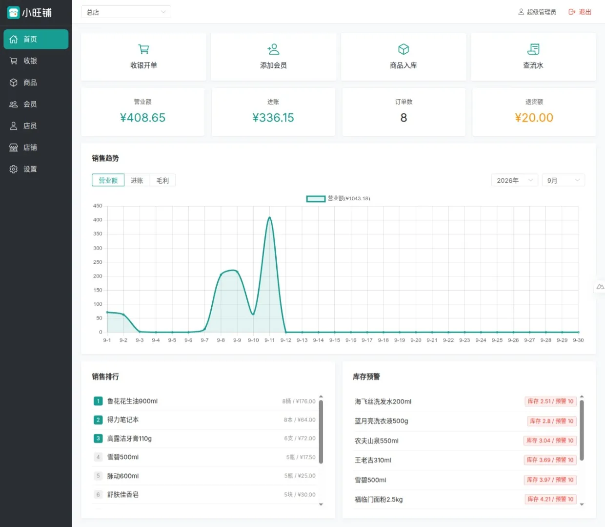

# 小旺铺：零售门店管理系统

专为中小零售门店打造的**多门店 POS 收银 + 会员 + 库存**系统。一个后台管所有分店：扫码开单秒结账，会员余额积分自动记，库存实时同步，老板在手机上随时看每家店今天赚了多少。


## 功能截图

| 收银开单 | 会员管理 |
|---|---|
|  |  |

| 库存管理 | 数据看板 |
|---|---|
|  |  |

## 功能特性

| 模块 | 说明 |
|---|---|
| 🧾 收银开单 | 扫码/键盘开单，现金·扫码·会员余额混合结算，支持退货 |
| 👥 会员管理 | 会员档案、余额充值、余额消费、积分赠送/兑换 |
| 🎟️ 计次项目 | 次卡类服务：分配次数、扣次 |
| 📦 商品库存 | 商品增删改、Excel 批量导入、库存流水、盘点 PDF 导出 |
| 🏪 多门店 | 总部一个后台看全部门店，各店数据严格隔离 |
| 👤 员工权限 | 超管 / 店长 / 店员三级权限，店员看不到利润 |
| 📱 短信 | 短信验证码登录、会员通知短信 |
| 💾 数据备份 | 一键导出全库备份、支持导入恢复 |
| 📊 数据看板 | 每店流水、热销商品实时统计 |

## 技术栈

- 前端：Nuxt 3（SPA）+ Vue 3 + Naive UI，移动端自适应
- 后端：Cloudflare Workers
- 数据库：Cloudflare D1（SQLite），首次访问自动建表，无需手动迁移
- 认证：JWT + PBKDF2 密码哈希

## 本地开发

```bash
# 环境要求：Node.js 20+
npm install
npm run dev
```

启动后访问 `http://localhost:3000/setup`，按向导创建管理员账号和第一家店铺即可使用。

## 生产部署

```bash
# 1. 登录 Cloudflare
npx wrangler login

# 2. 创建数据库，记下返回的 database_id
npx wrangler d1 create xiaowangpu

# 3. 复制配置模板，把 database_id 填进去
cp wrangler.toml.example wrangler.toml
# 编辑 wrangler.toml：database_id = "你的id"

# 4. 设置登录密钥
npx wrangler secret put NUXT_JWT_SECRET

# 5. 构建并部署
env -u NUXT_JWT_SECRET npm run deploy
```

部署成功后访问 `https://你的worker.workers.dev/setup` 初始化管理员，即可使用。

> ⚠️ **警告：打生产包时本机不能设置 `NUXT_JWT_SECRET`**
> 构建时会把该变量的值烘进产物，等于把你的登录密钥公开。
> 务必用 `env -u NUXT_JWT_SECRET npm run deploy`（Windows 请先执行 `$env:NUXT_JWT_SECRET=$null`），
> 密钥只通过第 4 步的 `wrangler secret put` 注入到你自己的 Worker。

## Cloudflare免费配额

本应用已针对Cloudflare配额优化，免费额度足够小店日常使用：

| 项目 | 免费额度 | 小店够用吗 |
|---|---|---|
| Workers 请求 | 10 万次 / 天 | ✅ |
| D1 读取 | 500 万行 / 天 | ✅ |
| D1 写入 | 10 万行 / 天 | ✅ |

超出后 Cloudflare 会限流，请求将返回错误。

## 账号角色

| 角色 | 权限 |
|---|---|
| 超管 admin | 所有店铺数据，可切换查看任意店，唯一能做数据备份、配短信的人 |
| 店长 manager | 只看本店，可管理本店店员 |
| 店员 clerk | 只看本店，只能收银和查会员，看不到利润 |
